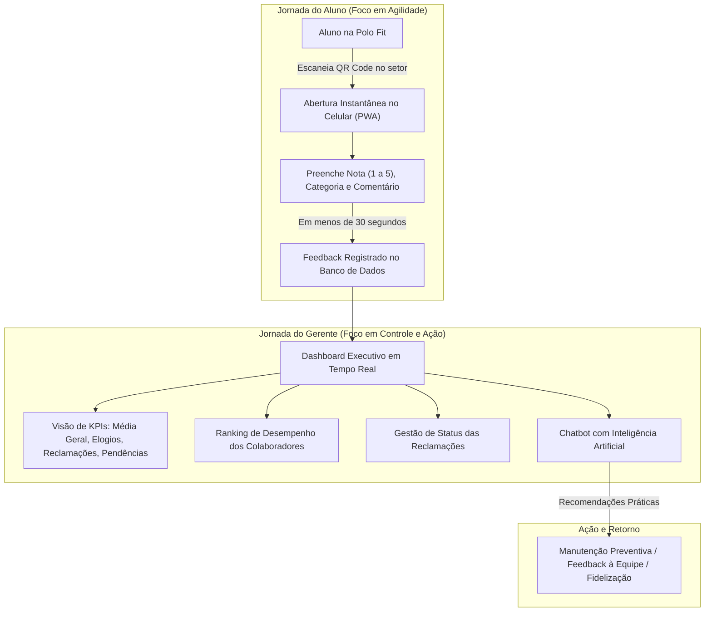

# POLO FEEDBACK — DOCUMENTAÇÃO EXECUTIVA PARA GESTÃO
> **Plataforma Inteligente de Gestão da Experiência do Cliente & Inteligência Operacional**  
> *Academia Polo Fit • Versão 2.0*

---

## 1. Sumário Executivo

O **Polo Feedback** é uma solução tecnológica desenvolvida sob medida para a **Polo Fit**, projetada para transformar a maneira como a academia escuta seus alunos, identifica gargalos operacionais e toma decisões estratégicas.

Tradicionalmente, academias enfrentam o desafio do "feedback invisível": a maioria dos alunos insatisfeitos cancela sua matrícula silenciosamente sem relatar o problema à recepção. O **Polo Feedback** resolve este problema ao posicionar pontos de escuta rápidos e acessíveis (via QR Code e aplicativo PWA), combinados com um **Dashboard Executivo em Tempo Real** e um **Consultor de Inteligência Artificial Conversacional** dedicado à gerência.

### Principais Ganhos para a Polo Fit:
1. **Redução de Churn (Cancelamentos):** Detecção imediata de insatisfações antes que resultem em perda de receita recorrente.
2. **Eficiência Operacional:** Triagem rápida de manutenções necessárias (ar-condicionado, equipamentos, vestiários) e organização de chamados com fluxo de status (*Pendente* → *Em Análise* → *Resolvida*).
3. **Reconhecimento da Equipe:** Métricas de desempenho individuais por professor e recepcionista, baseadas na voz direta dos alunos.
4. **Decisões Estratégicas Guiadas por Dados:** Fim do "achismo" gerencial através de gráficos, relatórios e do assistente de IA.

---

## 2. Arquitetura da Solução & Jornadas de Uso



---

## 3. Módulos do Sistema

### 3.1. Portal do Aluno (Mobile & Web)
- **Acesso sem Barreira de Entrada:** Não exige cadastro prévio ou senhas, eliminando o atrito para o aluno opinar.
- **Identificação de Localização:** O aluno pode indicar o local (Recepção, Sala de Musculação, Vestiários, Pilates, etc.) ou o sistema já pré-seleciona via QR Code do setor.
- **Avaliação Multicritério:** Permite selecionar nota (estrelas de 1 a 5), múltiplas áreas (Estrutura, Limpeza, Professores, Equipamentos, Atendimento) e tipo de feedback (Elogio, Sugestão, Reclamação).
- **Avaliação de Colaboradores:** Card dedicado para selecionar o instrutor ou recepcionista que prestou o atendimento.
- **Suporte PWA Offline:** Permite ser instalado na tela inicial do celular como um aplicativo nativo.

### 3.2. Painel Executivo do Gerente (Dashboard)
- **Indicadores Chave de Performance (KPIs):**
  - Média Geral de Satisfação (0 a 5).
  - Total de Avaliações Registradas.
  - Distribuição percentual de Elogios, Reclamações e Sugestões.
  - Total de Chamados Pendentes vs. Resolvidos.
- **Filtros Dinâmicos e Flexíveis:**
  - Filtro por Período: Hoje, Esta Semana, Últimos 30 Dias ou Todo o Período.
  - Filtro por Categoria, Tipo de Feedback e Colaborador específico.
- **Matriz de Status Operacional:**
  - O gerente altera o status de cada chamado diretamente em tela (`Pendente`, `Em Análise`, `Resolvida`).
  - O sistema registra automaticamente quem foi o gestor responsável pela tratativa e a data da conclusão.
- **Exportação e Análise Visual:**
  - Gráficos interativos com distribuição de notas e volumetria por setor.

### 3.3. Gerador e Central de QR Codes
- Geração automática de QR Codes personalizados para cada ponto de contato físico da academia:
  - *QR Code Recepção* (recepção e balcão de entrada).
  - *QR Code Musculação* (quadro de avisos da musculação).
  - *QR Code Vestiários* (portas e espelhos dos vestiários).
  - *QR Code Pilates / Treino Funcional*.
- Página de impressão com layout profissional e instrução clara para os alunos.

---

## 4. Inteligência Artificial Integrada: O Grande Diferencial

O Polo Feedback conta com uma camada de **Inteligência Artificial Executiva** construída sobre a tecnologia do Google Gemini, integrada nativamente ao banco de dados da academia.

### 4.1. Resumo Executivo em 1 Clique
No topo do painel, o gerente clica em **"Gerar Diagnóstico da IA"** e recebe em segundos:
- Visão geral sintética do humor dos alunos.
- Principais pontos de atrito identificados nos comentários.
- Recomendações imediatas de melhoria prioritária.

### 4.2. Chatbot Conversacional do Gerente (Assistente Estratégico)
Diferente de relatórios estáticos, o gerente pode **conversar com a IA** no painel como se estivesse dialogando com um consultor sênior de negócios.

#### Exemplos de Perguntas que o Gerente pode fazer no Chat:
- *"Qual setor recebeu mais reclamações nos últimos dias e por qual motivo?"*
- *"Como está a avaliação do professor Mariana Instrutora em comparação com os outros?"*
- *"Quais são as três principais sugestões dos alunos para a academia?"*
- *"O que os alunos estão falando sobre o ar-condicionado e a limpeza dos vestiários?"*
- *"Qual plano de ação você recomenda para subirmos nossa nota média de 4.2 para 4.8?"*

#### Garantia de Disponibilidade (Motor Híbrido com Fallback):
O sistema possui arquitetura com tolerância a falhas. Caso haja instabilidade na conexão externa com a API de IA ou ausência de chave de internet, o **Motor Analítico Local** assume o processamento instantaneamente, respondendo às dúvidas do gerente com base estatística exata, sem nunca exibir mensagens de erro em tela.

---

## 5. Roteiro Prático para a Reunião com o Gerente (5 Minutos)

Para apresentar o projeto com o máximo de impacto, siga esta sequência:

| Minuto | Etapa | O que mostrar | Mensagem Chave |
| :---: | :--- | :--- | :--- |
| **01** | **Contexto & Problema** | Abrir a página inicial do sistema | *"Hoje perdemos alunos que saem em silêncio. Criamos uma forma simples de escutá-los antes que cancelem."* |
| **02** | **Experiência do Aluno** | Enviar uma avaliação de teste pelo formulário | *"Em menos de 30 segundos o aluno avalia pelo celular, escolhe o setor, a nota e o colaborador."* |
| **03** | **Painel em Tempo Real** | Atualizar o Dashboard e mostrar a nova avaliação | *"Instantaneamente o gerente tem a métrica atualizada, sabe quem atendeu e o que precisa ser ajustado."* |
| **04** | **Assistente de IA em Ação** | Fazer uma pergunta no chat da IA do painel | *"A IA analisa todos os comentários e nos dá diagnósticos estratégicos e planos de ação em linguagem humana."* |
| **05** | **Ação Operacional** | Alterar status de uma pendência para 'Resolvida' | *"O painel não é só visual: ele organiza a operação e garante que nenhum problema do aluno fique esquecido."* |

---

## 6. Acesso Local e Credenciais de Teste

- **URL do Sistema Local:** `http://127.0.0.1:8000`
- **Acesso pelo Celular na mesma rede Wi-Fi:** `http://192.168.102.114:8000`
- **Área do Gerente (Login):** `http://127.0.0.1:8000/login/`
  - **Usuário:** `admin`
  - **Senha:** `admin`

---

## 7. Publicação na Nuvem (Hospedagem no Render para Enviar o Link ao Gerente)

O projeto está totalmente configurado e preparado para hospedagem em nuvem gratuita no **Render.com** através dos arquivos de infraestrutura inclusos no repositório (`render.yaml` e `build.sh`).

### Passo a Passo para Gerar o Link Online:

1. **Subir as alterações para o repositório GitHub:**
   ```bash
   git add .
   git commit -m "feat: entregaveis Polo Feedback para o gerente"
   git push origin main
   ```

2. **Acessar o painel do Render:**
   - Acesse [https://render.com](https://render.com) e faça login com sua conta do GitHub.
   - Clique em **"New +"** no canto superior direito e selecione **"Blueprint"**.
   - Conecte seu repositório `PoloFeedback`.
   - O Render detectará automaticamente o arquivo `render.yaml` e configurará o banco PostgreSQL e o Web Service Python com Whitenoise e Gunicorn.

3. **Deploy Automático:**
   - Clique em **"Apply"**.
   - O Render executará o `build.sh` que instala dependências, compila arquivos estáticos, roda migrações e provisiona automaticamente o usuário gestor `admin`.

4. **Enviar o Link ao Gerente:**
   - O Render fornecerá uma URL pública do tipo: `https://polofeedback.onrender.com`
   - O gerente poderá testar a página inicial, preencher feedbacks e fazer login no painel executivo de qualquer computador ou celular, sem necessidade de instalar nada.

---

## 8. Conclusão

O **Polo Feedback** não é apenas um sistema de formulários; é uma **ferramenta de gestão de excelência e fidelização de clientes** que posiciona a Polo Fit na vanguarda do setor fitness, aliando design contemporâneo, facilidade de uso e inteligência artificial aplicada ao negócio.
